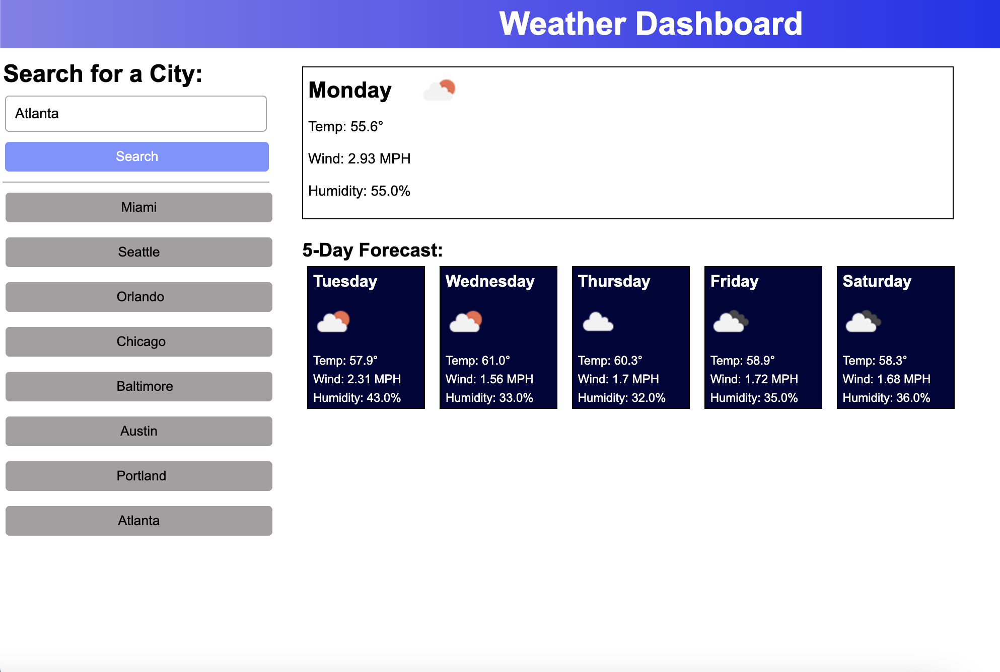

# Weather Dashboard
A 5-Day Weather Dashboard Application.

## Table of Contents
* [Description and Usage](#description-and-usage)
* [My Weather Dashboard](#my-weather-dashboard)
* [Links to My Weather Dashboard](#links-to-my-weather-dashboard)
* [Questions](#questions)

## Description and Usage

This application uses the [OpenWeatherMap](https://openweathermap.org/api) API for weather data. When you first deploy the application it will automatically load weather data for San Diego. If you enter another city name in the search bar, it will then load the data for the new city. The weather data included in the 5-day forecast are the temperature, wind, and humidity values.

## My Weather Dashboard

The following screenshot shows the weather dashboard's appearance and functionality is:

## Links to My Weather Dashboard

- [URL for the GitHub repository](https://github.com/kdrummond528/Weather-Dashboard)

- [Link for the deployed application](https://kdrummond528.github.io/Weather-Dashboard/)

## Questions

Feel free to [email me](mailto:k.drummond528@gmail.com) with any questions, comments, or requests.

Checkout my [GitHub](https://github.com/kdrummond528)!

View [My Portfolio](https://kdrummond528.github.io/Personal-Portfolio/)!