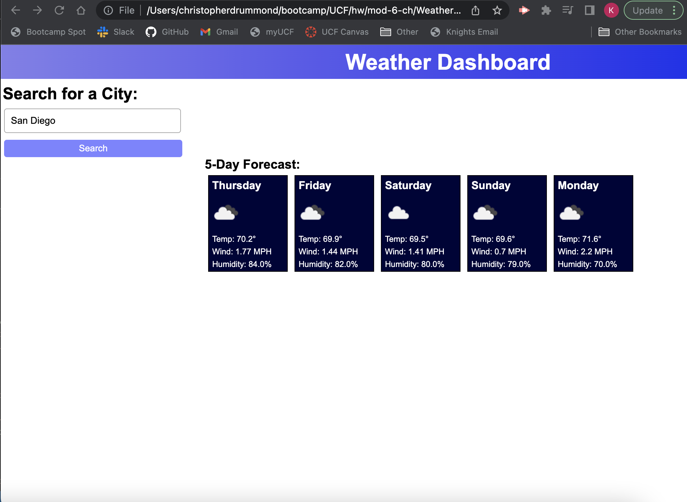

# Weather Dashboard
This challenge called to create a weather dashboard that would run in the browser with data from another application's API.

## API
I chose to use the weather data from openweathermap.org for my API.

## Mock-Up
The following image shows what the intended web application's appearance and functionality should be:

## My Weather Dashboard

## Challenges Making Weather Dashboard
Getting the API to function properly was the most difficult and time-consuming part of this challenge, but I learned a lot from this challenge that will help me in the future when using API's.

I ran out of time and was unable to include the search history in the aside, and the report for the day above the 5-day forecast.